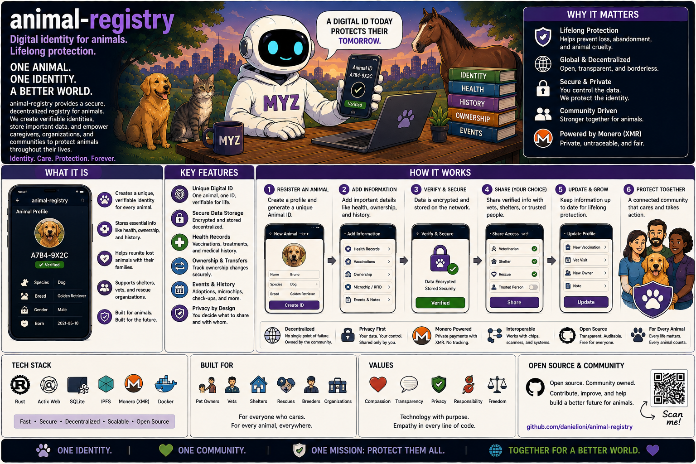

# MyZubster Animal Registry

<p align="center">
  
</p>

> 🌍 **Understand MyZubster in your language:** [Global multilingual guide](https://github.com/MyZubster-Ecosystem/myzubster/blob/main/docs/i18n/README.md) — English, Italiano, Español, Français, Deutsch, Português, 中文, 日本語, 한국어, العربية, हिन्दी, Русский, Türkçe, Bahasa Indonesia, Polski, Українська, বাংলা, اردو, فارسی, Kiswahili.
>
> MyZubster connects real-world observations, verifiable evidence, collaborative bounties and platform rewards. **MYZ is currently an internal reward/accounting ledger; external XMR/token/blockchain settlement is separate and independently verified.**

> Part of the [MyZubster ecosystem](https://github.com/MyZubster-Ecosystem/myzubster).

Experimental open-source animal registry, NFC payload and verification tooling for the MyZubster ecosystem.

## Status

**Alpha / active development.** This repository contains registry and NFC-related software experiments. It must not be described as a production blockchain registry unless a specific deployment, network and independently verifiable record prove that claim.

The repository previously contained conflicting README merge markers and historical claims about automatic XMR rewards/blockchain storage. Those statements are not the current source of truth.

## Scope

The project explores:

- structured animal registration records;
- species/category metadata;
- NFC tag payload generation and decoding;
- secure/encrypted NFC tag experiments;
- registry-record verification through an injectable provider;
- browser-based NFC simulation;
- future mapping/mobile integrations.

## NFC tooling

Standard MyZubster NFC payloads use the `myzubster:nfc:v1:` namespace.

Example CLI usage where supported by the current source tree:

```bash
node bin/generate-nfc-tag.js registration.json
node bin/verify-nfc-tag.js "myzubster:nfc:v1:..."
```

Run the repository tests before relying on an NFC workflow:

```bash
npm test
```

See the files under `docs/` for payload/verification details that correspond to the current implementation.

## Verification model

A decoded NFC payload is only evidence supplied to a verifier. Verification requires comparison with the configured registry provider/source of truth.

Do not equate:

```text
NFC tag exists
```

with:

```text
animal identity independently verified
```

The provider contract and verification result must be explicit.

## Privacy and animal-safety rules

Do not publish unnecessary owner/contact data, private home locations or sensitive wildlife locations. Public animal observations should use only the location precision necessary for the use case.

Do not disturb, capture, handle or enter restricted/private areas merely to complete a registry task or bounty.

## Bounties and rewards

Repository work may be tracked through GitHub issues and may be associated with a MyZubster bounty when an issue explicitly defines the reward, acceptance criteria and review rules.

The canonical policy is:

- [MyZubster Bounty System](https://github.com/MyZubster-Ecosystem/myzubster/blob/main/BOUNTIES.md)
- [Ecosystem Architecture](https://github.com/MyZubster-Ecosystem/myzubster/blob/main/docs/ECOSYSTEM.md)

Important:

- historical XMR amounts in old issues/docs are not proof of payment;
- issue closure or PR merge does not prove an external settlement;
- MYZ in the current core platform is an internal reward/accounting ledger;
- any external XMR/token payment must remain pending/unsettled until independently verified.

See this repository's `BOUNTIES.md` for local scope.

## Development

Install and test using the package scripts available in the repository:

```bash
npm ci
npm test
```

Never commit private keys, wallet seed phrases, production tokens or credentials.

## Related repositories

- [myzubster](https://github.com/MyZubster-Ecosystem/myzubster) — core ecosystem and canonical contracts
- [MyZubsterGateway](https://github.com/MyZubster-Ecosystem/MyZubsterGateway) — integration boundary
- [MyZubster-App](https://github.com/MyZubster-Ecosystem/MyZubster-App) — mobile/client track
- [myzubster-docs](https://github.com/MyZubster-Ecosystem/myzubster-docs) — documentation hub

## Contributing

Use the open issues for scoped work. A contribution should include reproducible tests/evidence and should avoid claims beyond what the code and deployment can verify.

## License

See the repository license files for the authoritative license terms.
